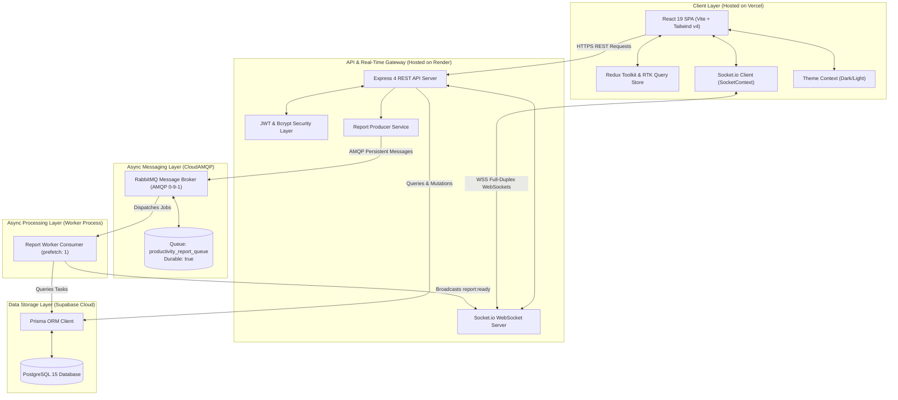
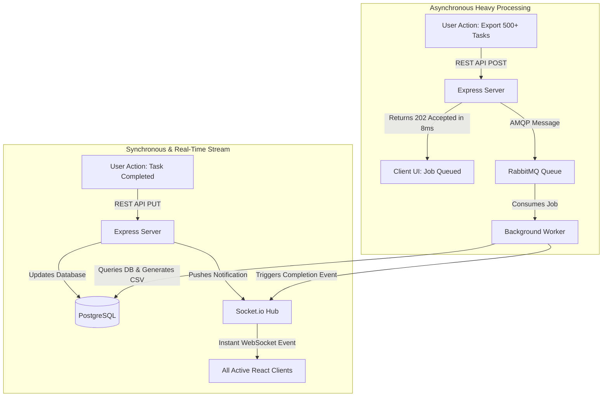
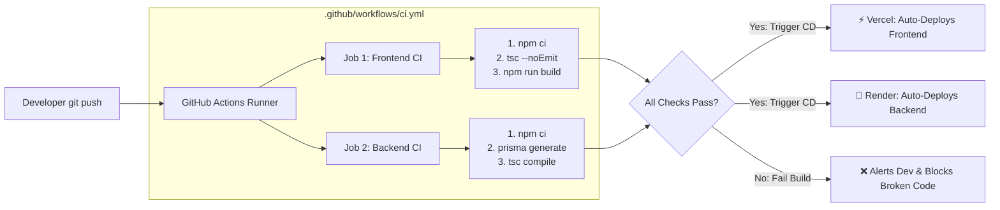

# 🏛️ Complete System Architecture & Data Flow

This document provides visual architectural diagrams illustrating how the entire full-stack ecosystem interacts across **React 19**, **Socket.io**, **RabbitMQ (AMQP)**, **Prisma**, **PostgreSQL**, and **GitHub Actions CI/CD**.

---

## 1. High-Level Full-Stack System Architecture

---

## 2. Real-Time Socket vs. AMQP Message Queue: Role Division

---

## 3. Monorepo CI/CD & Deployment Pipeline

