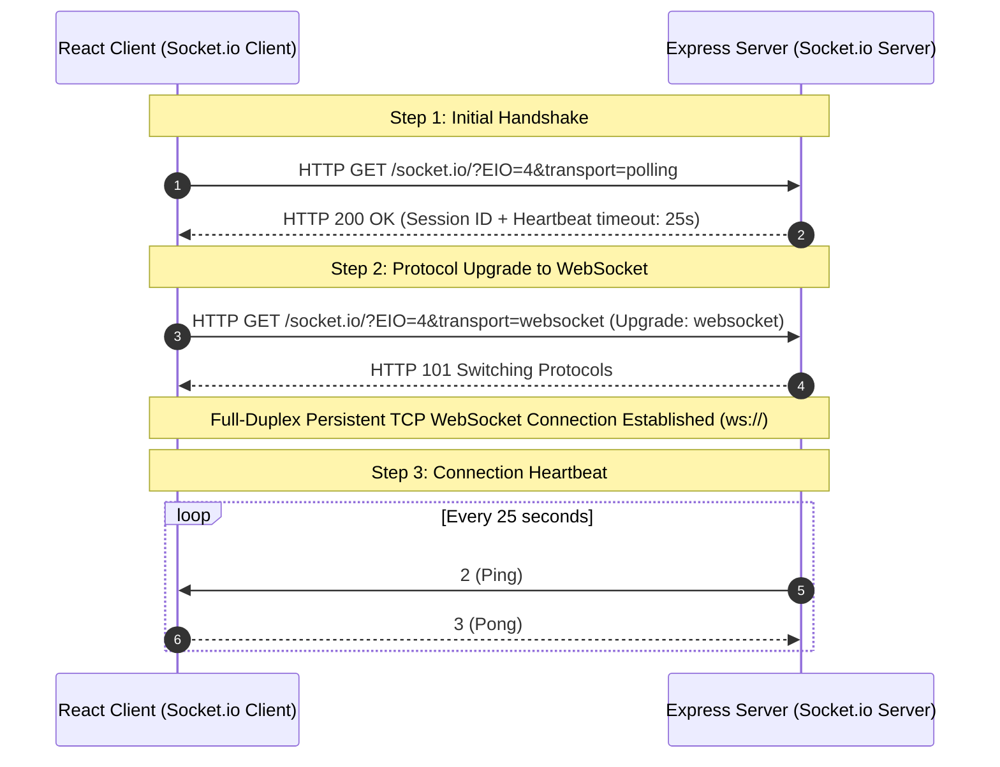
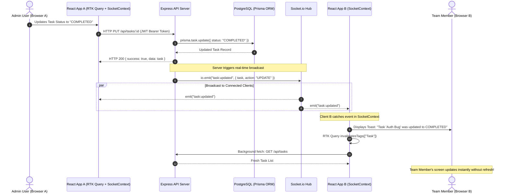

# ⚡ Real-Time Socket.io Integration & Architecture Guide

## 1. Architectural Overview & Data Flow

**TaskTrack** utilizes **Socket.io** (built on top of the WebSocket protocol with HTTP long-polling fallback) to deliver low-latency, bidirectional state synchronization between the Node.js Express backend and React 19 clients.

Instead of clients making repeated polling requests (which wastes server CPU and bandwidth), the server pushes real-time event notifications to all active clients whenever a task is created, updated, or removed.

---

## 2. Visual Architecture & Sequence Diagrams

### A. Handshake & Connection Lifecycle


---

### B. Real-Time Mutation & Multi-Client Broadcast Workflow


---

## 3. Backend Implementation Details

### Server Initialization (`backend/src/server.ts`)
Express is mounted inside Node's native `http.createServer` so both standard HTTP endpoints and WebSocket connections share port `5000`:

```typescript
import express from "express";
import http from "http";
import { Server as SocketIOServer } from "socket.io";

const app = express();
const server = http.createServer(app);

export const io = new SocketIOServer(server, {
  cors: {
    origin: "*",
    methods: ["GET", "POST", "PUT", "DELETE", "PATCH"],
  },
});

io.on("connection", (socket) => {
  console.log(`🔌 Client connected: ${socket.id}`);

  socket.on("disconnect", () => {
    console.log(`❌ Client disconnected: ${socket.id}`);
  });
});

server.listen(5000, () => {
  console.log("Server running on port 5000");
});
```

---

## 4. Frontend Implementation Details

### Single Persistent Connection (`frontend/src/context/SocketContext.tsx`)
Managed cleanly in React's component tree to prevent connection duplication across re-renders:

```typescript
import React, { createContext, useContext, useEffect, useState } from "react";
import { io, Socket } from "socket.io-client";

interface SocketContextType {
  socket: Socket | null;
  isConnected: boolean;
  showNotification: (msg: string, type?: "success" | "info" | "warning") => void;
}

const SocketContext = createContext<SocketContextType>({} as SocketContextType);

export const SocketProvider: React.FC<{ children: React.ReactNode }> = ({ children }) => {
  const [socket, setSocket] = useState<Socket | null>(null);
  const [isConnected, setIsConnected] = useState(false);

  useEffect(() => {
    const socketInstance = io(import.meta.env.VITE_API_URL?.replace("/api", "") || "http://localhost:5000", {
      transports: ["websocket", "polling"],
      reconnectionAttempts: 5,
      reconnectionDelay: 2000,
    });

    socketInstance.on("connect", () => setIsConnected(true));
    socketInstance.on("disconnect", () => setIsConnected(false));

    setSocket(socketInstance);

    return () => {
      socketInstance.disconnect();
    };
  }, []);

  return (
    <SocketContext.Provider value={{ socket, isConnected, showNotification }}>
      {children}
    </SocketContext.Provider>
  );
};
```

---

## 5. Event Catalog & Payload Reference

| Event Channel | Direction | Payload Example | UI Effect |
| :--- | :--- | :--- | :--- |
| `task:created` | Server -> All Clients | `{ task: {...}, message: "New task created" }` | Invalidate Task list cache & display Toast |
| `task:updated` | Server -> All Clients | `{ task: {...}, message: "Task marked done" }` | Real-time card status update & progress meter bump |
| `task:deleted` | Server -> All Clients | `{ taskId: "...", message: "Task removed" }` | Instant table row removal |
| `report:ready` | Server -> Requesting Client | `{ jobId: "...", downloadUrl: "/api/reports/..." }` | Auto-triggers file browser CSV download |
